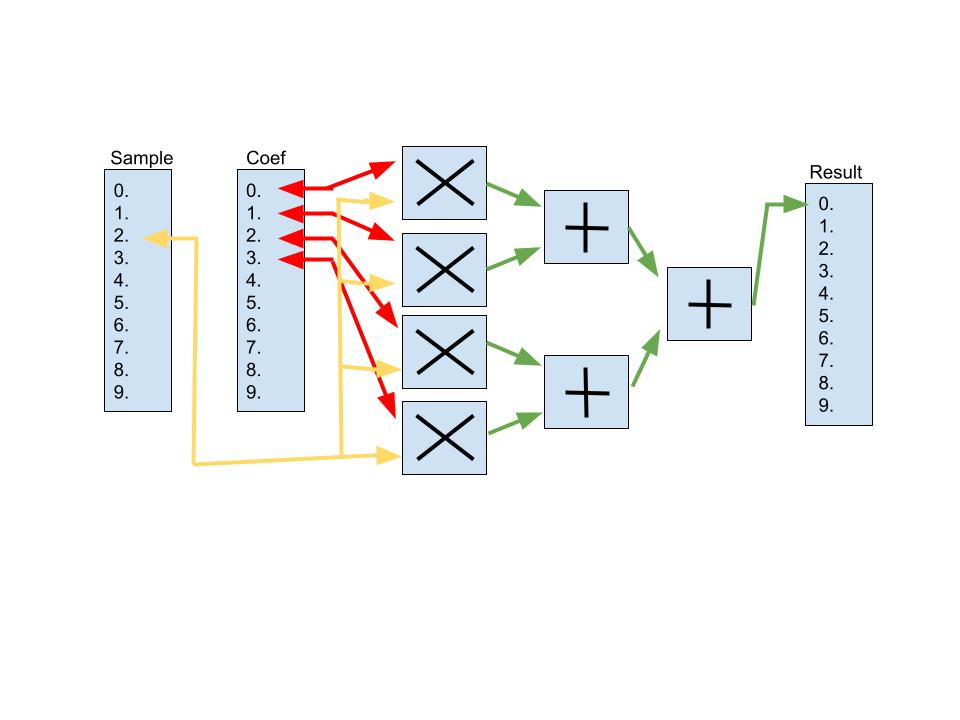

# FIR Filter and MONARCH DSP Core

#### Interface explanation:

     - Sample Data Input is pushed into a FIFO-Stack.

     - Coefficient Data Input is pushed into a FIFO-Stack.

     - Product/Sum Data can be popped out of a FIFO-Stack.

    In the above diagram, the rectangles are the FIFO-Stacks. These are pushed into and popped at the arrow 
    location (pointer). 

    The final output fifo will be pushed full of results and an external accumulator generates the rolling sum.